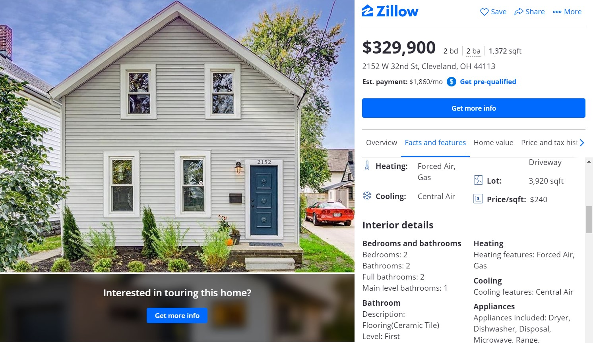
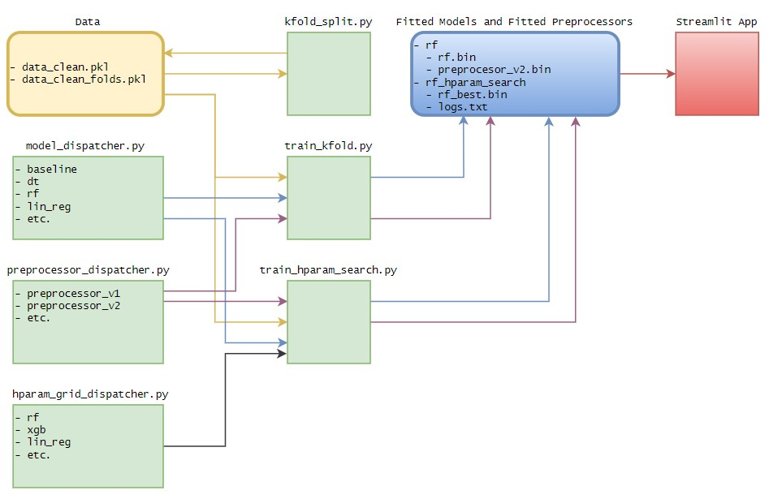

# Cleveland Real Estate Price Prediction

This repository presents an end-to-end process of approaching a machine learning project from data collection to deployment. Problem at hand is price prediction of Cleveland real estate although the underlying code is made flexible enough to provide a structured way of tackling a wide variety of tabular problems with minimal changes.

## Table of Contents
* [App](#app)
* [Setup](#setup)
* [Data](#data)
    * [Listing example](#training-dqn)
    * [Datapoint example](#visualization-and-debugging-tools)
* [Zillow scraper](#zillow-scraper)
* [Flow Diagram](#flow-diagram)
* [Usage](#usage)
* [Citation](#citation)
* [License](#license)

## App 
The app is made with [Streamlit](https://streamlit.io/) and is tailored for a random forest model, providing feature importances and contributions. It also contains a useful 3D visualization made with the help of [pydeck](https://deckgl.readthedocs.io/en/latest/).

https://user-images.githubusercontent.com/57716666/115991011-94978e00-a5c6-11eb-9c89-c38606b5325b.mp4

## Data
Data was collected through web scrapping of Sold Cleveland real-estate listings from [Zillow](https://www.zillow.com/) in various intervals from `01/4/2021` to `25/4/2021`. Data is open-sourced in this repository inside `/data/raw`.

### Listing example:


### Datapoint example:
```
{
   "basic_info":{
      "sale_date":"Sold 04/14/2021",
      "latitude":41.432756,
      "longitude":-81.809063,
      "floorSize":"1,664",
      "url":"https://www.zillow.com/homedetails/4486-W-158th-St-Cleveland-OH-44135/33380420_zpid/",
      "price":"$140,000"
   },
   "facts_and_features":{
      "Type:":"SingleFamily",
      "Year built:":"1952",
      "Heating:":"Forced Air, Gas",
      "Cooling:":"Central Air",
      "Parking:":"Detached, Garage",
      "Lot:":"0.15 Acres"
   },
   "additional_features":{
      "Interior details":{
         "Bedrooms and bathrooms":{
            "Bedrooms":"4",
            "Bathrooms":"1",
            "Full bathrooms":"1",
            "Main level bathrooms":"1"
         },
         "Basement":{
            "Has basement":"Yes",
            "Basement":"None"
         },
         "Heating":{
            "Heating features":"Forced Air, Gas"
         },
         "Cooling":{
            "Cooling features":"Central Air"
         },
         "Appliances":{
            "Appliances included":"Dryer, Range, Refrigerator, Washer"
         },
         "Other interior features":{
            "Total structure area":"1,664",
            "Total interior livable area":"1,664 sqft",
            "Finished area above ground":"1,664",
            "Virtual tour":"View virtual tour"
         }
      },
      "Property details":{
         "Parking":{
            "Parking features":"Detached, Garage",
            "Garage spaces":"1"
         },
         "Property":{
            "Exterior features":"Paved Driveway"
         },
         "Lot":{
            "Lot size":"0.15 Acres"
         },
         "Other property information":{
            "Additional parcel(s) included":",,,",
            "Parcel number":"02828056"
         }
      },
      "Construction details":{
         "Type and style":{
            "Home type":"SingleFamily",
            "Architectural style":"Bungalow",
            "Property subType":"Single Family Residence"
         },
         "Material information":{
            "Construction materials":"Brick, Vinyl Siding",
            "Roof":"Asphalt,Fiberglass"
         },
         "Condition":{
            "Year built":"1952"
         }
      },
      "Utilities / Green Energy Details":{
         "Utility":{
            "Sewer information":"Public Sewer",
            "Water information":"Public"
         }
      },
      "Community and Neighborhood Details":{
         "Location":{
            "Region":"Cleveland"
         }
      },
      "HOA and financial details":{
         "HOA":{
            "Has HOA fee":"No"
         },
         "Other financial information":{
            "Tax assessed value":"$66,200",
            "Annual tax amount":"$1,884"
         }
      },
      "Other":{
         "Other facts":{
            "Ownership":"Principal/NR"
         }
      }
   }
}
```


## Zillow scraper
The scraper is provided inside `scripts/data/zillow_scraper.py`. It scrappes most of the information from the *Facts and Features* section of a listing and the listing header. It supports pagination. 

**To use the scraper you need to edit the url, request header and searchQueryState inside the script.**

```
python scripts/data/zillow_scraper.py
```

## Setup 
Using Miniconda/Anaconda:
1. `cd path_to_repo`
2. `conda env create`
3. `conda activate real-estate-price-prediction`

## Flow Diagram
The main ML code is structured as depicted below. It offers a structured approach to data splitting, data preprocesing & model search.

<a>
  <p align="center">
    
  </p>
</a>


## Usage
Before running the below commands customize the `src/config.py` file if needed.

**Perform a k-fold split**:
```
bash scripts/data/kfold_split.sh
```
**Train various models with default hyperparameters**:
```
bash scripts/train/train_kfold_all.sh
```
**Fine-tune a promising model**
```
bash scripts/train/train_hparam_search.sh
```
**Streamlit app deployment**  
```
bash scripts/deployment/streamlit.py
```

## Citation
Please use this bibtex if you want to cite this repository:
```
@misc{Koch2021realestatepricepred,
  author = {Koch, Brando},
  title = {real-estate-price-prediction},
  year = {2021},
  publisher = {GitHub},
  journal = {GitHub repository},
  howpublished = {\url{https://github.com/bkoch4142/real-estate-price-prediction}},
}
```

## License
This repository is under an MIT License

[](https://github.com/bkoch4142/real-estate-price-prediction/blob/master/LICENSE)
